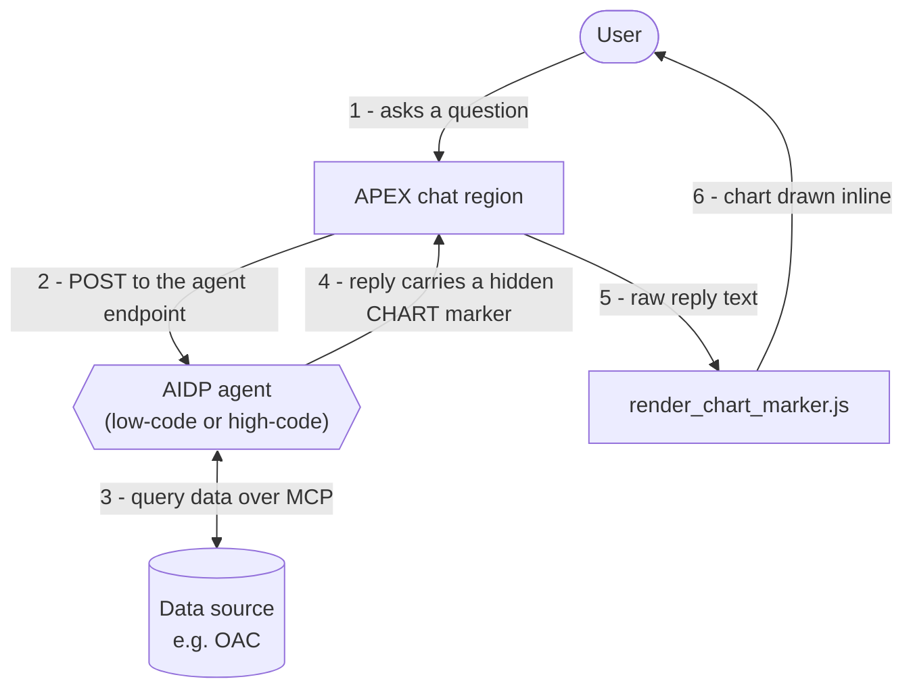

# APEX Chat with Inline Charts (over OAC via MCP)

Render an AIDP agent's answers as **inline charts inside an Oracle APEX chat**.
When the agent replies with a category-to-number breakdown (e.g. "sales by
region"), a horizontal bar, pie, vertical bar, line, donut, pyramid, or funnel
chart appears directly beneath the answer in the chat transcript.

The trick is a small, agent-agnostic **chart marker**: the agent appends a
hidden marker to its reply, and a bit of JavaScript in the APEX chat region
turns that marker into a chart. Because the marker is the same regardless of how
the agent is built, **a low-code AIDP agent and a high-code agent both work with
the identical front-end.**

## Contents

- [What this sample is (and isn't)](#what-this-sample-is-and-isnt)
- [Features](#features)
- [How it works](#how-it-works)
- [Prerequisites](#prerequisites)
- [Step-by-step](#step-by-step)
  - [Step 1 - Teach your agent to emit the chart marker](#step-1---teach-your-agent-to-emit-the-chart-marker)
  - [Step 2 - Upload the renderer into your APEX app](#step-2---upload-the-renderer-into-your-apex-app)
  - [Step 3 - Call the renderer when an answer arrives](#step-3---call-the-renderer-when-an-answer-arrives)
  - [Step 4 - Connect your APEX chat to the deployed agent endpoint](#step-4---connect-your-apex-chat-to-the-deployed-agent-endpoint)
- [The chart marker](#the-chart-marker)
- [Troubleshooting](#troubleshooting)
- [Security notes](#security-notes)
- [Folder layout](#folder-layout)

## What this sample is (and isn't)

This sample is **only the chart layer** - the two chart-specific pieces you add
on top of a working agent chat. It is **not** a full chat application.

To get an inline chart in APEX, you need all four of these:

| # | What you need | Provided by |
|---|---------------|-------------|
| 1 | A deployed AIDP agent connected to your data (low-code or high-code) | You |
| 2 | An APEX chat region that sends messages to the agent and shows the reply | You - or build one with the sibling samples below |
| 3 | The agent taught to emit the chart marker | **This sample** → [`agent/`](agent/) |
| 4 | APEX code that reads the marker and draws the chart | **This sample** → [`apex/render_chart_marker.js`](apex/render_chart_marker.js) |

Items 1-2 are generic chat plumbing, already covered by
`../invoke-agent-flows-from-apex/` (calling an agent flow from APEX) and
`../../../aidp_chat_client/` (a standalone chat client). **Bring your own chat
surface; this sample adds the charts to it** (items 3-4). The renderer is
self-contained - it loads Chart.js on demand and needs no extra CSS.

## Features

- Inline charts rendered in the chat transcript, right under each answer.
- Seven chart types from one marker: `hbar`, `pie`, `bar`, `line`, `donut`, `pyramid`, `funnel`.
- **Time series on a real date axis:** when the breakdown is by date/period, the answer renders as a line on a chronological time axis. The renderer even upgrades a date-labelled `hbar`/`bar` to a time-axis line, so "count by year" looks right without relying on the model to pick `line`.
- **Clickable bar legend:** `hbar`/`bar` charts get a per-category colour legend with click-to-hide, while keeping real bars.
- **Agent-agnostic:** low-code (pasted instructions) and high-code (a prompt rule) emit the identical marker.
- No build step: one plain JS file; Chart.js is fetched on demand only for the donut.

## How it works



This sample provides two of those pieces: the **chart rule** the agent follows
([`agent/`](agent/)), which drives step 4, and the **renderer**
([`apex/render_chart_marker.js`](apex/render_chart_marker.js)) at steps 5-6. The
chat region, the agent, and the data source are yours.

The agent carries the chart in its reply as a hidden HTML comment, so it never
shows in the chat bubble:

```
Here is sales by region:
| Region | Sales |
| North  |  120  |  ...
<!--CHART:{"type":"hbar","title":"Sales by region","data":[...]}-->
```

The full marker format and type list are in [The chart marker](#the-chart-marker) below.

## Prerequisites

1. An **AIDP agent** connected to your data, deployed, and reachable from APEX. It can be **low-code or high-code** (this sample supports both).
2. An **Oracle APEX** workspace and app with a **chat region** that sends the user's message to the agent and shows the agent's reply.
3. A data source your agent can query. This sample was built against **Oracle Analytics Cloud (OAC) over MCP**, but the chart layer does not care where the numbers come from.

If you do not yet have #1 and #2, set those up first using the sibling samples
linked above, then come back here to add charts.

## Step-by-step

### Step 1 - Teach your agent to emit the chart marker

Pick the path that matches how your agent is built. Both produce the **same**
marker, so you only ever do one of these.

**Low-code agent**
1. Open your agent in the AIDP Workbench and edit its **Instructions**.
2. Copy the chart-rule block from [`agent/low-code-instructions.md`](agent/low-code-instructions.md) and paste it **after** your existing data/query instructions.
3. Save.

**High-code agent**
1. Open [`agent/high-code-marker-snippet.py`](agent/high-code-marker-snippet.py).
2. Copy the `CHART_BLOCK_RULE` string and add it to your agent's prompt rules (for the AIDP Python SDK this is `prompt.extra_rules`; for a raw system prompt, append it to the system prompt text). The file shows both.
3. Your agent's own setup and auth stay as they are - if you connect to OAC over MCP, the wiring example is `../../code-first/mcp-examples/single-agent-mcp-session-variables.py`.

**Verify Step 1:** ask the agent *"break down sales by region"*. The raw reply
should end with a line like:
```
<!--CHART:{"type":"hbar","title":"Sales by region","data":[{"label":"North","value":120}, ...]}-->
```

### Step 2 - Upload the renderer into your APEX app

These steps **add the chart renderer to an existing chat region** - they do not
create the chat region itself (that is the prerequisite above). Do this in
**App Builder** on the app that has your chat page:

1. Open your app in **App Builder**.
2. Go to **Shared Components** &rarr; under *Files*, click **Static Application Files**.
3. Click **Create File** (or **Upload File**), select [`apex/render_chart_marker.js`](apex/render_chart_marker.js), and click **Create**. APEX now serves it at `#APP_FILES#render_chart_marker.js`.
4. Open the page that has your chat region in **Page Designer**.
5. In the Rendering tree, select the **page root** node (the very top), then in the Property Editor open the **JavaScript** group.
6. In **File URLs**, add this line:
   ```
   #APP_FILES#render_chart_marker.js
   ```
7. Click **Save**.

This loads the renderer and defines a global `ACPChart` object (methods
`renderAfter()`, `renderInto()`, `scan()`). Nothing draws yet - Step 3 calls it.

> Prefer not to upload a file? Instead of steps 2-3, paste the entire contents
> of `render_chart_marker.js` into the region's **JavaScript &rarr; Function and
> Global Variable Declaration**.

### Step 3 - Call the renderer when an answer arrives

The renderer needs the **raw** agent reply (still containing the marker). Run
`ACPChart` right after your chat renders an assistant answer. The standard APEX
way, using a Dynamic Action:

1. In Page Designer, add a **Dynamic Action** on your chat region that fires when a new answer appears (for many chat regions that is the region's **After Refresh** event; adapt it to your chat's own event).
2. Add a **True action &rarr; Execute JavaScript Code** with:
   ```js
   // Each assistant answer element should carry data-agent-answer and still
   // contain the raw marker in its text. Then:
   ACPChart.scan(document.getElementById('YOUR_CHAT_REGION_STATIC_ID'), '[data-agent-answer]');
   ```
3. Click **Save**, then **Run** the page.

If instead your chat region renders each answer itself in JavaScript, just call
`ACPChart.renderAfter(answerEl, rawText)` as you append the answer - where
`answerEl` is the answer's element and `rawText` is the raw reply (with the
marker).

> **Gotcha - the marker must reach the browser.** The renderer can only draw
> what it can see. If your region strips HTML comments or only stores a
> "cleaned" reply, keep the raw reply available to the client (e.g. in the
> element's text or a data attribute) so the marker survives to Step 3.

### Step 4 - Connect your APEX chat to the deployed agent endpoint

This is your existing chat plumbing; the chart layer rides on top of it. If you
still need to wire it:

1. In the AIDP Workbench, open your **deployed** agent and go to its **Details**.
2. Copy the agent's **endpoint / invocation URL**.
3. Configure your APEX chat region to POST the user's message to that endpoint
   and display the reply. See `../invoke-agent-flows-from-apex/` for a full
   worked example of calling an agent from APEX, and `../../../aidp_chat_client/`
   for a standalone chat client.

## The chart marker

The agent appends **one** HTML comment on its own final line, after the prose.
Because it is a comment it never shows in the bubble; the renderer reads it from
the raw reply:

```
<!--CHART:{"type":"hbar","title":"Sales by region","data":[{"label":"North","value":120},{"label":"South","value":90}]}-->
```

**Fields**

| Field   | Type   | Notes |
|---------|--------|-------|
| `type`  | string | One of `hbar`, `pie`, `bar`, `line`, `donut`, `pyramid`, `funnel` (lowercase). |
| `title` | string | Short chart title shown above the chart. |
| `data`  | array  | One object per category: `{ "label": "<category>", "value": <number> }`. |
| `xAxis` | string | **Optional, `line` only.** Set to `"time"` for a time series; then every `label` must be an ISO date (`"YYYY-MM-DD"`) in ascending order, and the chart renders on a real chronological axis. Set to `"category"` to force a plain axis (opt out of the auto time-axis upgrade). |

`value` is a plain number (no quotes, thousands separators, or currency); include
every row you listed. Valid JSON between `CHART:` and `-->` - no code fences, no
second comment, nothing after `-->`.

A time-series marker looks like this:

```
<!--CHART:{"type":"line","xAxis":"time","title":"Invoices by month","data":[{"label":"2026-01-01","value":120},{"label":"2026-02-01","value":150}]}-->
```

**Types**

| `type` | Renders as | Good for |
|--------|------------|----------|
| `hbar` | Horizontal bar with a clickable category legend (default, auto) | Rankings and comparisons; long labels. |
| `donut` | Donut with a centre total (auto for composition) | Share of a whole, total called out. |
| `line` | Line; on a real time axis when `xAxis:"time"` (auto for date/time breakdowns) | A value across an ordered or time sequence. |
| `bar` | Vertical bar with a clickable category legend | Comparisons where a vertical layout reads better. |
| `pie` | Pie | Share of a whole (when explicitly asked). |
| `pyramid` | Pyramid | Ranked stages / hierarchy. |
| `funnel` | Funnel | Stages that shrink (e.g. a pipeline). |

The agent **auto-picks only `hbar`, `donut`, or a time-axis `line`**; `bar`,
`pie`, `pyramid`, and `funnel` appear only when the user names them. Separately,
the renderer upgrades any date-labelled `hbar`/`bar`/`line` to a time-axis line
(unless the marker sets `xAxis:"category"`), so a "count by year" reads as a
trend even if the agent picked `hbar`. Bare 4-digit labels only count as years
inside 1900–2100, so 4-digit category codes (departments, postal prefixes)
never trigger the upgrade. The full selection rule the agent follows
lives in the [`agent/`](agent/) files.

## Troubleshooting

| Symptom | Likely cause | Fix |
|---------|--------------|-----|
| No chart appears | The marker never reached the browser | Confirm the raw reply (with the `<!--CHART...-->` comment) is what Step 3 reads; don't strip comments server-side. |
| No chart, but the raw reply has a marker | Renderer not loaded, or not called | Confirm `render_chart_marker.js` is on the page (Step 2) and `renderAfter`/`scan` runs after the answer renders (Step 3). |
| Donut renders as a plain pie (no centre total) | Chart.js failed to load; the renderer fell back to the JET pie so the chart still shows | Check the network request to the pinned Chart.js URL; the CDN host must be reachable. All other types use JET and need no CDN. |
| A "count by year" renders as a line, not bars | The renderer auto-upgrades date-labelled data to a time-axis line | Expected. To force bars, set `"xAxis":"category"` in the marker (or the agent's rule). |
| Chart renders twice | `scan()` ran more than once on the same answer | The `data-acp-charted` guard prevents this per element; make sure you reuse the same element, not a re-created one. |
| Agent shows a table but no marker | The chart rule isn't in effect | Re-check Step 1 - the rule must be pasted/added after the agent's other instructions, and saved/redeployed. |

## Security notes

- This sample contains **no secrets and no environment-specific values** - all example data is invented. Keep it that way in your fork.
- The agent endpoint URL, any credentials, and your data connection live in your
  APEX app and agent config, **not** in these files.
- The renderer sanitizes nothing itself; it only reads a marker and draws a
  chart. Keep using your chat region's existing HTML sanitization for the answer
  text (this sample assumes markdown is rendered and sanitized upstream).

## Folder layout

```
apex-chat-charts-over-oac-mcp/
├── README.md                         <- you are here (the guide + the marker spec)
├── agent/
│   ├── low-code-instructions.md      <- paste into a low-code agent's Instructions
│   └── high-code-marker-snippet.py   <- add the rule to a high-code agent's prompt
└── apex/
    └── render_chart_marker.js        <- paste into APEX; turns the marker into a chart
```
